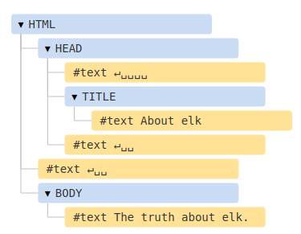
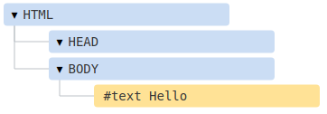
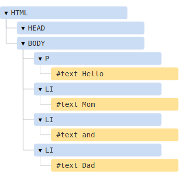
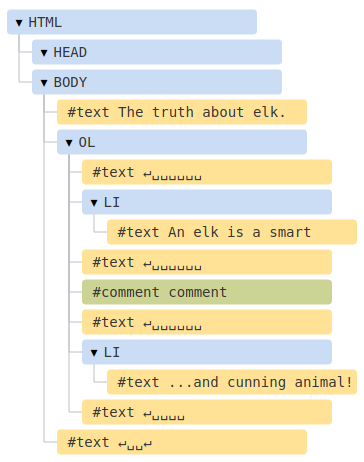
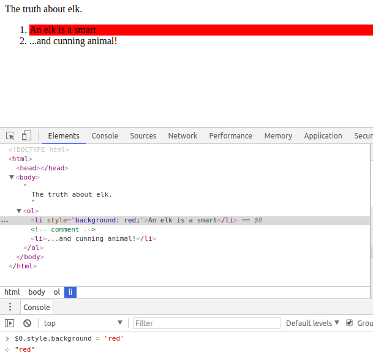

## EL árbol DOM

La columna vertebral de un documento HTML son las etiquetas.

De acuerdo con el Modelo de Objetos del Documento (DOM), cada etiqueta HTML es un objeto. Las etiquetas anidadas se llaman "hijos" del que los contiene.

El texto dentro de una etiqueta también es un objeto.

Todos estos objetos son accesibles usando JavaScript, y podemos usarlos para modificar la página.

## Un ejemplo del DOM

Comencemos con el siguiente documento simple:

```html
<!DOCTYPE HTML>
<html>
<head>
  <title>About elk</title>
</head>
<body>
  The truth about elk.
</body>
</html>
```

El DOM representa el HTML como una estructura de árbol de etiquetas.



Las etiquetas se denominan nodos de elementos (o simplemente elementos) y forman un Árbol de Elementos: `<html>` es La raíz, entonces `<head>` y `<body>` son sus hijos, etc.

El texto dentro de los elementos forman nodos de texto, etiquetados como `#text`. Un nodo de texto contiene solo una cadena. Puede que no tenga hijos y siempre es una hoja del árbol.

Por ejemplo, la etiqueta `<title>` tiene el texto "About elk".

Tenemos en cuenta los caracteres especiales en los nodos de texto:

* Una nueva línea: ↵(en JavaScript se conoce como \n)
* Un espacio: ␣

Los espacios y las nuevas líneas son caracteres totalmente válidos, forman nodos de texto y se convierten en parte del DOM. Entonces, por ejemplo, en el ejemplo anterior, la etiqueta `<head>` contiene algunos espacios antes de title, y ese texto se convierte en un nodo #text(contiene una nueva línea y solo algunos espacios).

Solo hay dos exclusiones de nivel superior:

1. Los espacios y las nuevas líneas antes de `<head>` se ignoran por razones históricas.
2. Si colocamos algo después de `</body>`, entonces eso se mueve automáticamente dentro de `body`, al final, ya que la especificación HTML requiere que todo el contenido esté dentro de `<body>`. Así que no puede haber espacios después de `</body>`.
   
En los demás casos, todo es más sencillo: si hay espacios (como cualquier carácter) en el documento, entonces se pueden cambiar en nodos de texto en el DOM, y si los eliminamos, entonces no habrá ninguno.

Aquí no hay nodos de texto de solo espacios:

```html
<!DOCTYPE HTML>
<html><head><title>About elk</title>title</head><body>The truth about elk.</body></html>
```


## Autocorrección

Si el navegador encuentra HTML con formato incorrecto, corrige automáticamente al crear el DOM.

Por ejemplo, la etiqueta superior siempre es `<html>`. Incluso si no existe en el documento, existe en el DOM, el navegador lo creará. Lo mismo ocurre con `<body>`.

Como ejemplo, si el archivo HTML es una sola palabra "Hello", el navegador incluye <html> y <body>, y agrega el <head> requerido, el DOM será:



Al generar el DOM, los navegadores procesan automáticamente los errores en el documento, cierran etiquetas, etc.

Un documento con etiquetas no cerradas:

```html
<p>Hello
<li>Mom
<li>and
<li>Dad
```

se convierte en un DOM normal, ya que el navegador lee las etiquetas y restaura las partes faltantes:



## Otros tipos de nodos

Agreguemos más etiquetas y un comentario a la página:

```html
<!DOCTYPE HTML>
<html>
<body>
  The truth about elk.
  <ol>
    <li>An elk is a smart</li>
    <!-- comment -->
    <li>...and cunning animal!</li>
  </ol>
</body>
</html>
```



Aquí vemos un nuevo tipo de nodo de árbol: el *nodo comentario*, etiquetado como `#comment`, entre dos nodos de texto.

Podemos pensar: ¿por qué se agrega un comentario al DOM? No afecta a la representación visual de ninguna manera. Pero hay una regla: si algo está en el HTML, entonces también debe estar en el árbol DOM.

**Todo en el HTML, incluso los comentarios, se convierten en parte del DOM.**

Incluso la directiva `<! DOCTYPE ...>` al principio de HTML también es un nodo DOM. Está en el árbol DOM justo antes de `<html>`. No vamos a tocar ese nodo, ni siquiera lo dibujamos en diagramas por esa razón, pero está ahí.

El objeto `document` que representa todo el documento es, formalmente, un nodo DOM también.

Hay 12 tipos de nodos. En la práctica solemos trabajar solo con 4 de ellos:

1. `document` - el "punto de entrada" en el DOM.
2. Nodos de elementos: etiquetas HTML, los bloques de construcción del árbol.
3. Nodos de texto: contienen texto.
4. Comentarios: a veces podemos poner la información allí, no se mostrará, pero JS puede leerla desde el DOM.

## Velo por ti mismo

Para ver la estructura del DOM en tiempo real, prueba [Live DOM Viewer](http://software.hixie.ch/utilities/js/live-dom-viewer/). Simplemente escriba el documento y se mostrará el DOM en un instante.

Otra forma de explorar el DOM es usar las herramientas de desarrollo del navegador. En realidad, eso es lo que usamos cuando desarrollamos.

Para hacerlo, abre la página web [elk.html](elk.html), activa las herramientas de desarrollo del navegador y cambia a la pestaña Elementos.

Debe tener el siguiente aspecto:


Puedes ver el DOM, hacer clic en los elementos, ver sus detalles y así sucesivamente.

Al hacer clic en el botón en la esquina superior izquierda, se puede elegir un nodo de la página web usando el ratón e "inspeccionarlo" (desplácese hasta él en la pestaña Elementos). Esto funciona muy bien cuando tenemos una gran página HTML (y el enorme DOM correspondiente) y nos gustaría ver el lugar de un elemento particular en ella.

Otra forma de hacerlo sería simplemente haciendo clic derecho en una página web y seleccionando "Inspeccionar" en el menú contextual.

En la parte derecha de las herramientas puedes observar las siguientes subpestañas:

- **Styles**: podemos ver el CSS aplicado al elemento actual, incluidas las reglas utilizadas (gris). Casi todo se puede editar en el lugar, incluidas las dimensiones/márgenes/rellenos.
- **Computed**: para ver el CSS aplicado al elemento por propiedad, para cada propiedad podemos ver su origen (incluida la herencia de CSS y demás).
- ...y así.

La mejor manera de estudiarlos es hacer clic en ellos. La mayoría de los valores son editables en el lugar.

## Interacción con la consola.

A medida que exploramos el DOM, es posible que quieras aplicarle JavaScript. Como obtener un nodo y ejecutar algún código para modificarlo, para ver cómo se ve. Aquí hay algunos consejos para moverse entre la pestaña Elementos y la consola.

1. Selecciona el primer `<li>` en la pestaña Elementos.
2. Presiona `Esc`: se abrirá la consola justo debajo de la pestaña Elementos.

Ahora el último elemento seleccionado está disponible como `$0`, el seleccionado previamente es `$1`, etc.

Podemos ejecutar comandos sobre ellos. Por ejemplo, `$0.style.background = 'red'` hace que el elemento de la lista seleccionada se vuelva rojo, así:



Desde el otro lado, si estamos en la consola y tenemos una variable que hace referencia a un nodo DOM, entonces podemos usar el comando `inspect(node)` para verlo en el panel Elementos.

O simplemente podemos mostrarlo en la consola y explorar "en el lugar", como `document.body` en la siguiente imagen:

