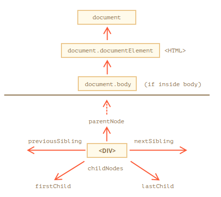

## Walking the DOM

El DOM nos permite hacer cualquier cosa con elementos y sus contenidos, pero primero debemos alcanzar el objeto DOM correspondiente.

Todas las operaciones en el DOM comienzan con el `document` objeto. Ese es el principal "punto de entrada" a DOM. Desde allí podemos acceder a cualquier nodo.

Aquí hay una imagen de enlaces que permiten viajar entre nodos DOM:





## On top: documentElement and body

Los nodos de árbol superiores están disponibles directamente como `document` propiedades:

`<html> = document.documentElement` 

El nodo de documento superior es document.documentElement. Ese es el nodo DOM de la etiqueta `<html>`.

`<body> = document.body` 

Otro nodo DOM utilizado es el elemento `<body>` - `document.body`.

`<head> = document.head` 

La `<head>` etiqueta está disponible como `document.head`.

"Hay un problema: document.bodypuede ser` nulo`" Un script no puede acceder a un elemento que no existe en el momento de la ejecución.

En particular, si hay un script dentro <head>, entonces document.bodyno está disponible, porque el navegador aún no lo ha leído.

Entonces, en el ejemplo a continuación, los primeros alertespectáculos null:

```html
<html>

<head>
  <script>
    alert( "From HEAD: " + document.body ); // null, there's no <body> yet
  </script>
</head>

<body>

  <script>
    alert( "From BODY: " + document.body ); // HTMLBodyElement, now it exists
  </script>

</body>
</html>
```

En el DOM, el valor null significa "no existe" o "no existe tal nodo".