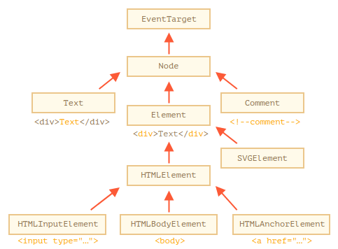

# Node properties: type, tag and contents

## DOM node classes

Diferentes nodos DOM pueden tener diferentes propiedades. Por ejemplo, un nodo de elemento correspondiente a la etiqueta `<a>` tiene propiedades relacionadas con el enlace, y el correspondiente a `<input>` tiene propiedades relacionadas con la entrada, etc. Los nodos de texto no son lo mismo que los nodos de elementos. Pero también hay propiedades y métodos comunes entre todos ellos, porque todas las clases de nodos DOM forman una sola jerarquía.

Cada nodo DOM pertenece a la clase incorporada correspondiente.

La raíz de la jerarquía es EventTarget, que es heredada por Node y otros nodos DOM heredan de él.



Las clases son:

- [EventTarget](https://dom.spec.whatwg.org/#eventtarget): es la clase raíz "abstracta". Los objetos de esa clase nunca se crean. Sirve como base, de modo que todos los nodos DOM admiten los llamados "eventos".
  
- [Node](http://dom.spec.whatwg.org/#interface-node): también es una clase "abstracta", que sirve como base para los nodos DOM. Proporciona la funcionalidad del árbol central: `parentNode`,` nextSibling`, `childNodes` y así sucesivamente (son captadores). Los objetos de la clase `Node` nunca se crean. Pero hay clases de nodos concretos que heredan de él: `Texto` para nodos de texto, `Elemento` para nodos de elementos y `Comentario` para nodos de comentarios.

- [Elemento](http://dom.spec.whatwg.org/#interface-element): es una clase base para elementos DOM. Proporciona navegación a nivel de elemento como `nextElementSibling`,` children` y métodos de búsqueda como `getElementsByTagName`,` querySelector`. Un navegador no solo admite HTML, sino también XML y SVG. La clase `Elemento` sirve como base para clases más específicas:` SVGElement`, `XMLElement` y` HTMLElement`.
  
- [HTMLElement](https://html.spec.whatwg.org/multipage/dom.html#htmlelement): finalmente es la clase básica para todos los elementos HTML. Se hereda de elementos HTML concretos:
  - [HTMLInputElement](https://html.spec.whatwg.org/multipage/forms.html#htmlinputelement): la clase para los elementos `<input>`,
  
  - [HTMLBodyElement](https://html.spec.whatwg.org/multipage/semantics.html#htmlbodyelement): la clase para los elementos `<body>`,
  
  - [HTMLAnchorElement](https://html.spec.whatwg.org/multipage/semantics.html#htmlanchorelement): la clase para los elementos `<a>`,
    
  - y así sucesivamente, cada etiqueta tiene su propia clase que puede proporcionar propiedades y métodos específicos.

Entonces, el conjunto completo de propiedades y métodos de un nodo dado viene como resultado de la herencia.

Por ejemplo, consideremos el objeto DOM para un elemento `<input>`. Pertenece a la clase HTMLInputElement.

- `HTMLInputElement`: esta clase proporciona propiedades específicas de entrada,
- `HTMLElement` - proporciona métodos comunes de elementos HTML (y getters / setters),
- `Elemento` - proporciona métodos de elementos genéricos,
- `Node` - proporciona propiedades de nodo DOM comunes.
- `EventTarget` - brinda soporte para eventos.
- y finalmente hereda de `Object`, por lo que también están disponibles métodos de" objeto plano "como` hasOwnProperty`.

Para ver el nombre de clase del nodo DOM, podemos recordar que un objeto generalmente tiene la propiedad `constructor`. Hace referencia al constructor de la clase, y `constructor.name` es su nombre:

``` js
alerta (document.body.constructor.name); // HTMLBodyElement
```

... O podemos simplemente `toString` it:

``` js
alerta (document.body); // [objeto HTMLBodyElement]
```

También podemos usar `instanceof` para verificar la herencia:

``` js
alerta (document.body instanceof HTMLBodyElement); // cierto
alerta (document.body instanceof HTMLElement); // cierto
alerta (document.body instanceof Element); // cierto
alerta (document.body instanceof Node); // cierto
alerta (document.body instanceof EventTarget); // cierto
```

Como podemos ver, los nodos DOM son objetos JavaScript normales. Utilizan clases basadas en prototipos para la herencia.

Eso también es fácil de ver al generar un elemento con `console.dir (elem)` en un navegador. Allí, en la consola, puede ver `HTMLElement.prototype`,` Element.prototype`, etc.


La mayoría de los navegadores admiten dos comandos en sus herramientas de desarrollador: `console.log` y` console.dir`. Sacan sus argumentos a la consola. Para los objetos JavaScript, estos comandos suelen hacer lo mismo.

Pero para los elementos DOM son diferentes:

- `console.log (elem)` muestra el árbol DOM del elemento.
- `console.dir (elem)` muestra el elemento como un objeto DOM, bueno para explorar sus propiedades.

Pruébelo en `document.body`.

En la especificación, las clases DOM no se describen usando JavaScript, sino un Lenguaje de descripción de interfaz especial (IDL), que generalmente es fácil de entender.

En IDL, todas las propiedades se anteponen con sus tipos. Por ejemplo, `DOMString`,` boolean` y así sucesivamente.

Aquí hay un extracto, con comentarios:

```js
// Definir HTMLInputElement
// Los dos puntos ":" significan que HTMLInputElement hereda de HTMLElement
interface HTMLInputElement: HTMLElement {
  // aquí van las propiedades y métodos de los elementos <input>

  // "DOMString" significa que el valor de una propiedad es una cadena
  attribute DOMString accept;
  attribute DOMString alt;
  attribute DOMString autocomplete;
  attribute DOMString value;

  // propiedad de valor booleano (verdadero / falso)
  attribute boolean autofocus;

  // ahora el método: "void" significa que el método no devuelve ningún valor

  void select();
}
```

## La propiedad "nodeType"

La propiedad `nodeType` proporciona una forma más" anticuada "de obtener el" tipo "de un nodo DOM.

Tiene un valor numérico:
- `elem.nodeType == 1` para nodos de elementos,
- `elem.nodeType == 3` para nodos de texto,
- `elem.nodeType == 9` para el objeto del documento,
- hay algunos otros valores en la especificación.

Por ejemplo:

```html
<body>
  <script>
  let elem = document.body;

  // ¿vamos a examinar qué es?
  alert (elem.nodeType); // 1 => elemento

  // y el primer hijo es ...
  alert (elem.firstChild.nodeType); // 3 => texto

  // para el objeto del documento, el tipo es 9
  alert (document.nodeType); // 9
  </script>
</body>
```

En los scripts modernos, podemos usar `instanceof` y otras pruebas basadas en clases para ver el tipo de nodo, pero a veces` nodeType` puede ser más simple. Solo podemos leer `nodeType`, no cambiarlo.

## Etiqueta: nodeName y tagName

Dado un nodo DOM, podemos leer su nombre de etiqueta de las propiedades `nodeName` o` tagName`:

Por ejemplo:

``` js
alert( document.body.nodeName ); // BODY
alert( document.body.tagName ); // BODY
```

¿Hay alguna diferencia entre `tagName` y `nodeName`?

La diferencia se refleja en sus nombres, pero de hecho es un poco sutil.

- La propiedad `tagName` existe solo para los nodos` Element`.
- El `nodeName` se define para cualquier `Node`:
    - para elementos significa lo mismo que `tagName`.
    - para otros tipos de nodos (texto, comentario, etc.) tiene una cadena con el tipo de nodo.

Por ejemplo, comparemos `tagName` y` nodeName` para el `document` y un nodo de comentario:

```html
<body><!-- comment -->

  <script>
    // para comentarios
    alert (document.body.firstChild.tagName); // indefinido (no es un elemento)
    alert (document.body.firstChild.nodeName); // # comentario

    // para el documento
    alerta (document.tagName); // indefinido (no es un elemento)
    alerta (document.nodeName); // #documento
  </script>
</body>
```

Si solo tratamos con elementos, entonces podemos usar tanto `tagName` como` nodeName`, no hay diferencia.

## innerHTML: el contenido

La propiedad [innerHTML](https://w3c.github.io/DOM-Parsing/#widl-Element-innerHTML) permite obtener el HTML dentro del elemento como una cadena.

También podemos modificarlo. Por lo tanto, es una de las formas más poderosas de cambiar la página.

El ejemplo muestra el contenido de `document.body` y luego lo reemplaza por completo:

```html
<body>
  <p>A paragraph</p>
  <div>A div</div>

  <script>
    alert( document.body.innerHTML ); // lee el contenido actual
    document.body.innerHTML = 'The new BODY!'; // reemplázado
  </script>

</body>
```

Podemos intentar insertar HTML no válido, el navegador corregirá nuestros errores:

```html
<body>

  <script>
    document.body.innerHTML = '<b> test'; // olvidé cerrar la etiqueta
    alert (document.body.innerHTML); // <b> test </b> (fijo)
  </script>

</body>
```

Si `innerHTML` inserta una etiqueta` <script> `en el documento, se convierte en parte de HTML, pero no se ejecuta.

### Cuidado: "innerHTML + =" hace una sobrescritura completa

Podemos agregar HTML a un elemento usando `elem.innerHTML + =" more html "`.

```js
chatDiv.innerHTML + = "<div> Hola ! </div>";
chatDiv.innerHTML + = "¿Cómo va?";
```

Pero debemos tener mucho cuidado al hacerlo, porque lo que está sucediendo no es una adición, sino una sobrescritura completa.

Técnicamente, estas dos líneas hacen lo mismo:

```js
elem.innerHTML + = "...";
// es una forma más corta de escribir:
elem.innerHTML = elem.innerHTML + "..."
```

En otras palabras, `innerHTML + =` hace esto:

1. Se elimina el contenido anterior.
2. En su lugar, se escribe el nuevo `innerHTML` (una concatenación del antiguo y el nuevo).

**Como el contenido está "puesto a cero" y reescrito desde cero, todas las imágenes y otros recursos se recargarán**.

También hay otros efectos secundarios. Por ejemplo, si el texto existente se seleccionó con el mouse, la mayoría de los navegadores eliminarán la selección al volver a escribir `innerHTML`. Y si hubo un `<input>` con un texto ingresado por el visitante, entonces el texto será eliminado. Y así.

## externalHTML: HTML completo del elemento

La propiedad `outerHTML` contiene el HTML completo del elemento. Eso es como `innerHTML` más el elemento en sí.

Aquí hay un ejemplo:

```html
<div id="elem">Hello <b>World</b></div>

<script>
  alert(elem.outerHTML); // <div id="elem">Hello <b>World</b></div>
</script>
```

**A diferencia de `innerHTML`, escribir en `outerHTML` no cambia el elemento. En cambio, lo reemplaza en el DOM.**

Sí, suena extraño, y es extraño, es por eso que hacemos una nota separada al respecto aquí. Echar un vistazo.

Considere el ejemplo:

```html
<div>Hello, world!</div>

<script>
  let div = document.querySelector('div');

  // reemplaza div.outerHTML con <p> ... </p>
  div.outerHTML = '<p>A new element</p>'; // (*)

  // ¡Guau! ¡'div' sigue siendo el mismo!
  alert(div.outerHTML); // <div>Hello, world!</div> (**)
</script>
```

Parece realmente extraño, ¿verdad?

En la línea `(*)` reemplazamos `div` por` <p> Un nuevo elemento </p> `. En el documento externo (DOM) podemos ver el nuevo contenido en lugar del `<div>`. Pero, como podemos ver en la línea `(**)`, ¡el valor de la antigua variable `div` no ha cambiado!

La asignación `outerHTML` no modifica el elemento DOM (el objeto al que hace referencia, en este caso, la variable 'div'), sino que lo elimina del DOM e inserta el nuevo HTML en su lugar.

Entonces, lo que sucedió en `div.outerHTML = ...` es:
- `div` fue eliminado del documento.
- Se insertó otra pieza de HTML `<p> Un nuevo elemento </p>` en su lugar.
- `div` todavía tiene su antiguo valor. El nuevo HTML no se guardó en ninguna variable.

Podemos escribir en `elem.outerHTML`, pero debemos tener en cuenta que no cambia el elemento al que estamos escribiendo ('elem'). Pone el nuevo HTML en su lugar. Podemos obtener referencias a los nuevos elementos consultando el DOM.

## nodeValue / data: contenido del nodo de texto

La propiedad `innerHTML` solo es válida para nodos de elementos.

Otros tipos de nodos, como los nodos de texto, tienen su contraparte: propiedades `nodeValue` y` data`. Estos dos son casi iguales para uso práctico, solo hay pequeñas diferencias de especificación. Entonces usaremos `data`, porque es más corto.

Un ejemplo de lectura del contenido de un nodo de texto y un comentario:

```html
<body>
  Hello
  <!-- Comment -->
  <script>
    let text = document.body.firstChild;
    alert(text.data); // Hello

    let comment = text.nextSibling;
    alert(comment.data); // Comment
  </script>
</body>
```

Para los nodos de texto podemos imaginar una razón para leerlos o modificarlos, pero ¿por qué comentar?

A veces, los desarrolladores incrustan información o instrucciones de plantilla en HTML, como esta:

```html
<! - if isAdmin ->
  <div> ¡Bienvenido, administrador! </div>
<! - / if ->
```

... Entonces JavaScript puede leerlo desde la propiedad `data` y procesar instrucciones incrustadas.

## textContent: texto puro

El `textContent` proporciona acceso al *text* dentro del elemento: solo texto, menos todos los` <tags> `.

Por ejemplo:

```html
<div id="news">
  <h1>Headline!</h1>
  <p>Martians attack people!</p>
</div>

<script>
  // Headline! Martians attack people!
  alert(news.textContent);
</script>
```

Como podemos ver, solo se devuelve el texto, como si todos los `<tags>` fueran recortados, pero el texto en ellos permaneciera.

**Escribir en `textContent` es mucho más útil, ya que permite escribir texto de la" manera segura ".**

Digamos que tenemos una cadena arbitraria, por ejemplo, ingresada por un usuario, y queremos mostrarla.

- Con `innerHTML` lo tendremos insertado" como HTML ", con todas las etiquetas HTML.
- Con `textContent` lo tendremos insertado" como texto ", todos los símbolos se tratan literalmente.

Compara los dos:

```html
<div id="elem1"></div>
<div id="elem2"></div>

<script>
  let name = prompt("What's your name?", "<b>Winnie-the-pooh!</b>");

  elem1.innerHTML = name;
  elem2.textContent = name;
</script>
```

1. El primer `<div>` obtiene el nombre "como HTML": todas las etiquetas se convierten en etiquetas, por lo que vemos el nombre en negrita.
2. El segundo `<div>` recibe el nombre "como texto", por lo que literalmente vemos `<b> Winnie-the-pooh! </b>`.

En la mayoría de los casos, esperamos el texto de un usuario y queremos tratarlo como texto. No queremos HTML inesperado en nuestro sitio. Una asignación a `textContent` hace exactamente eso.

## La propiedad "oculta"

El atributo "oculto" y la propiedad DOM especifica si el elemento es visible o no.

Podemos usarlo en HTML o asignarlo usando JavaScript, así:

```html
<div>Both divs below are hidden</div>

<div hidden>With the attribute "hidden"</div>

<div id="elem">JavaScript assigned the property "hidden"</div>

<script>
  elem.hidden = true;
</script>
```

Técnicamente, `hidden` funciona igual que` style = "display: none" `. Pero es más corto de escribir.

Aquí hay un elemento parpadeante:

```
<div id="elem">A blinking element</div>

<script>
  setInterval(() => elem.hidden = !elem.hidden, 1000);
</script>
```

## Más propiedades

Los elementos DOM también tienen propiedades adicionales, en particular las que dependen de la clase:

- `value` - el valor para` <input> `,` <select> `y` <textarea> `(` HTMLInputElement`, `HTMLSelectElement` ...).
- `href` - el" href "para` <a href="..."> `(` HTMLAnchorElement`).
- `id` - el valor del atributo" id ", para todos los elementos (` HTMLElement`).
- ...y mucho más...

Por ejemplo:

```html
<input type="text" id="elem" value="value">

<script>
  alert(elem.type); // "text"
  alert(elem.id); // "elem"
  alert(elem.value); // value
</script>
```

La mayoría de los atributos HTML estándar tienen la propiedad DOM correspondiente, y podemos acceder a ella de esa manera.

Si queremos conocer la lista completa de propiedades admitidas para una clase determinada, podemos encontrarlas en la especificación. 

O si nos gustaría obtenerlos rápidamente o si estamos interesados ​​en una especificación de navegador concreta, siempre podemos generar el elemento usando `console.dir (elem)` y leer las propiedades. O explore las "propiedades DOM" en la pestaña Elementos de las herramientas de desarrollo del navegador.