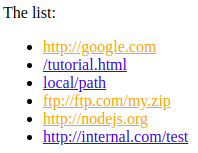

# Get the attribute

Escriba el código para seleccionar el elemento con el atributo `data-widget-name` del documento y para leer su valor.

```html
<!DOCTYPE html>
<html>
<body>

  <div data-widget-name="menu">Choose the genre</div>

  <script>
    /* your code */
  </script>
</body>
</html>
```

```html
<!DOCTYPE html>
<html>
<body>

  <div data-widget-name="menu">Choose the genre</div>

  <script>
    // getting it
    let elem = document.querySelector('[data-widget-name]'); //menu

    // reading the value
    alert(elem.dataset.widgetName);
    // or
    alert(elem.getAttribute('data-widget-name')); //menu
  </script>
</body>
</html>
```

# Make external links orange

Haga que todos los enlaces externos sean de color naranja alterando su propiedad `style`.

Un enlace es externo si:
- Su `href` tiene`: // `
- Pero no comienza con `http: // internal.com`.

Ejemplo:

```html
<a name="list">the list</a>
<ul>
  <li><a href="http://google.com">http://google.com</a></li>
  <li><a href="/tutorial">/tutorial.html</a></li>
  <li><a href="local/path">local/path</a></li>
  <li><a href="ftp://ftp.com/my.zip">ftp://ftp.com/my.zip</a></li>
  <li><a href="http://nodejs.org">http://nodejs.org</a></li>
  <li><a href="http://internal.com/test">http://internal.com/test</a></li>
</ul>

<script>
  // configuración de estilo para un solo enlace
  let link = document.querySelector('a');
  link.style.color = 'orange';
</script>
```

El resultado debería ser:



Encontramos todos los enlaces usando `document.querySelectorAll ('a')` y luego filtrar lo que necesitamos:

```html
<a name="list">the list</a>
<ul>
  <li><a href="http://google.com">http://google.com</a></li>
  <li><a href="/tutorial">/tutorial.html</a></li>
  <li><a href="local/path">local/path</a></li>
  <li><a href="ftp://ftp.com/my.zip">ftp://ftp.com/my.zip</a></li>
  <li><a href="http://nodejs.org">http://nodejs.org</a></li>
  <li><a href="http://internal.com/test">http://internal.com/test</a></li>
</ul>

<script>
  let links = document.querySelectorAll('a');

for (let link of links) {
  let href = link.getAttribute('href');
  if (!href) continue; // no attribute

  if (!href.includes('://')) continue; // no protocol

  if (href.startsWith('http://internal.com')) continue; // internal

  link.style.color = 'orange';
}
</script>
```
