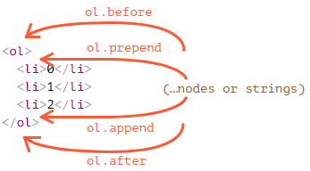
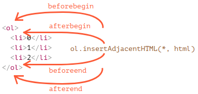

# Modifying the document

La modificación del DOM es la clave para crear páginas "en vivo".

Aquí veremos cómo crear nuevos elementos "sobre la marcha" y modificar el contenido de la página existente.

## Ejemplo: mostrar un mensaje

Demostremos usando un ejemplo. Agregaremos un mensaje en la página que se vea mejor que `alert`.

Así es como se verá:

```html
<style>
.alert {
  padding: 15px;
  border: 1px solid #d6e9c6;
  border-radius: 4px;
  color: #3c763d;
  background-color: #dff0d8;
}
</style>

<div class="alert">
  <strong>Hi there!</strong> You've read an important message.
</div>
```

Ese fue un ejemplo HTML. Ahora creemos el mismo `div` con JavaScript (suponiendo que los estilos estén en el HTML o en un archivo CSS externo).

## Creating an element

Para crear nodos DOM, hay dos métodos:

`document.createElement(tag)`
Crea un nuevo *nodo de elemento* con la etiqueta dada:

    ```js
    let div = document.createElement('div');
    ```

`document.createTextNode(text)`
Crea un nuevo *nodo de texto* con el texto dado:

    ```js
    let textNode = document.createTextNode('Here I am');
    ```

    ### Creating the message

En nuestro caso, el mensaje es un `div` con clase` alert` y el HTML que contiene:

```js
let div = document.createElement('div');
div.className = "alert";
div.innerHTML = "<strong>Hi there!</strong> You've read an important message.";
```

Creamos el elemento, pero a partir de ahora solo está en una variable. No podemos ver el elemento en la página, ya que aún no es parte del documento.

## Insertion methods

Para que aparezca el `div`, necesitamos insertarlo en algún lugar del` documento`. Por ejemplo, en `document.body`.

Hay un método especial `append` para eso:` document.body.append (div) `.

Aquí está el código completo:

```html
<style>
.alert {
  padding: 15px;
  border: 1px solid #d6e9c6;
  border-radius: 4px;
  color: #3c763d;
  background-color: #dff0d8;
}
</style>

<script>
  let div = document.createElement('div');
  div.className = "alert";
  div.innerHTML = "<strong>Hi there!</strong> You've read an important message.";

  document.body.append(div);
</script>
```

Este conjunto de métodos proporciona más formas de insertar:

- `node.append(...nodes or strings)` - agregar nodos o cadenas al final de `node`,
- `node.prepend(...nodes or strings)` - insertar nodos o cadenas al comienzo de `node`,
- `node.before(...nodes or strings)` - inserte nodos o cadenas antes de `nodo`,
- `node.after (... nodes or strings)` - inserta nodos o cadenas después de `node`,
- `node.replaceWith (... nodes or strings)` - reemplaza `node` con los nodos o cadenas dados.

Aquí hay un ejemplo del uso de estos métodos para agregar elementos a una lista y el texto anterior / posterior:

```html
<ol id="ol">
  <li>0</li>
  <li>1</li>
  <li>2</li>
</ol>

<script>
  ol.before('before'); // insert string "before" before <ol>
  ol.after('after'); // insert string "after" after <ol>

  let liFirst = document.createElement('li');
  liFirst.innerHTML = 'prepend';
  ol.prepend(liFirst); // insert liFirst at the beginning of <ol>

  let liLast = document.createElement('li');
  liLast.innerHTML = 'append';
  ol.append(liLast); // insert liLast at the end of <ol>
</script>
```

Aquí hay una imagen visual de los métodos:



Entonces la lista final será:

```html
before
<ol id="ol">
  <li>prepend</li>
  <li>0</li>
  <li>1</li>
  <li>2</li>
  <li>append</li>
</ol>
after
```

Estos métodos pueden insertar múltiples listas de nodos y piezas de texto en una sola llamada.

Por ejemplo, aquí se insertan una cadena y un elemento:

```html
<div id="div"></div>
<script>
  div.before('<p>Hello</p>', document.createElement('hr'));
</script>
```

Todo el texto se inserta *como texto*.

Entonces el HTML final es:

```html
&lt;p&gt;Hello&lt;/p&gt;
<hr>
<div id="div"></div>
```

En otras palabras, las cadenas se insertan de manera segura, como lo hace `elem.textContent`.

Por lo tanto, estos métodos solo se pueden usar para insertar nodos DOM o piezas de texto.

## insertAdjacentHTML/Text/Element

Para eso podemos usar otro método bastante versátil: `elem.insertAdarestHTML (where, html)`.

El primer parámetro es una palabra de código, que especifica dónde insertar en relación con `elem`. Debe ser uno de los siguientes:

- `" beforebegin "` - inserte `html` inmediatamente antes de` elem`,
- `" afterbegin "` - inserte `html` en` elem`, al principio,
- `" beforeend "` - inserte `html` en` elem`, al final,
- `" afterend "` - inserte `html` inmediatamente después de` elem`.

El segundo parámetro es una cadena HTML, que se inserta "como HTML".

Por ejemplo:

```html
<div id="div"></div>
<script>
  div.insertAdjacentHTML('beforebegin', '<p>Hello</p>');
  div.insertAdjacentHTML('afterend', '<p>Bye</p>');
</script>
```

...Llevaría a:

```html
<p>Hello</p>
<div id="div"></div>
<p>Bye</p>
```

Así es como podemos agregar HTML arbitrario a la página.

Aquí está la imagen de las variantes de inserción:



Podemos notar fácilmente similitudes entre esta y la imagen anterior. Los puntos de inserción son en realidad los mismos, pero este método inserta HTML.

El método tiene dos hermanos:

- `elem.insertAdarestText (where, text)` - la misma sintaxis, pero se inserta una cadena de `texto`" como texto "en lugar de HTML,
- `elem.insertAdarestElement (where, elem)` - la misma sintaxis, pero inserta un elemento.

Existen principalmente para hacer que la sintaxis sea "uniforme". En la práctica, `insertAd adyacenteHTML` se usa la mayor parte del tiempo. Porque para los elementos y el texto, tenemos métodos `append / prepend / before / after`: son más cortos de escribir y pueden insertar nodos / piezas de texto.

Así que aquí hay una variante alternativa de mostrar un mensaje:

```html
<style>
.alert {
  padding: 15px;
  border: 1px solid #d6e9c6;
  border-radius: 4px;
  color: #3c763d;
  background-color: #dff0d8;
}
</style>

<script>
  document.body.insertAdjacentHTML("afterbegin", `<div class="alert">
    <strong>Hi there!</strong> You've read an important message.
  </div>`);
</script>
```

## Node removal

Para eliminar un nodo, hay un método `node.remove ()`.

Hagamos que nuestro mensaje desaparezca después de un segundo:

```html
<style>
.alert {
  padding: 15px;
  border: 1px solid #d6e9c6;
  border-radius: 4px;
  color: #3c763d;
  background-color: #dff0d8;
}
</style>

<script>
  let div = document.createElement('div');
  div.className = "alert";
  div.innerHTML = "<strong>Hi there!</strong> You've read an important message.";

  document.body.append(div);
  setTimeout(() => div.remove(), 1000);
</script>
```

**Todos los métodos de inserción eliminan automáticamente el nodo del lugar anterior.**

Por ejemplo, intercambiemos elementos:

```html
<div id="first">First</div>
<div id="second">Second</div>
<script>
  // no es necesario llamar a eliminar
  second.after(first); // tome # segundo y luego inserta # primero
</script>
```

## Cloning nodes: cloneNode

Para insertar un mensaje similar más, podríamos hacer una función y poner el código allí. Pero la forma alternativa sería *clonar* el `div` existente y modificar el texto dentro de él (si es necesario).

A veces, cuando tenemos un gran elemento, puede ser más rápido y más simple.

- La llamada `elem.cloneNode (true)` crea un clon del elemento, con todos los atributos y subelementos. Si llamamos a `elem.cloneNode (false)`, entonces el clon se realiza sin elementos secundarios.

Un ejemplo de copia del mensaje:

```html
<style>
.alert {
  padding: 15px;
  border: 1px solid #d6e9c6;
  border-radius: 4px;
  color: #3c763d;
  background-color: #dff0d8;
}
</style>

<div class="alert" id="div">
  <strong>Hi there!</strong> You've read an important message.
</div>

<script>
  let div2 = div.cloneNode(true); // clone the message
  div2.querySelector('strong').innerHTML = 'Bye there!'; // change the clone

  div.after(div2); // show the clone after the existing div
</script>
```

## DocumentFragment [#document-fragment]

`DocumentFragment` es un nodo DOM especial que sirve como envoltorio para pasar listas de nodos.

Podemos agregarle otros nodos, pero cuando lo insertamos en algún lugar, su contenido se inserta en su lugar.

Por ejemplo, `getListContent` a continuación genera un fragmento con elementos` <li> `, que luego se insertan en` <ul> `:

```html 
<ul id="ul"></ul>

<script>
function getListContent() {
  let fragment = new DocumentFragment();

  for(let i=1; i<=3; i++) {
    let li = document.createElement('li');
    li.append(i);
    fragment.append(li);
  }

  return fragment;
}

ul.append(getListContent()); // (*)
</script>
```

Tenga en cuenta que en la última línea `(*)` agregamos `DocumentFragment`, pero se" combina ", por lo que la estructura resultante será:

```html
<ul>
  <li>1</li>
  <li>2</li>
  <li>3</li>
</ul>
```

`DocumentFragment` rara vez se usa explícitamente. No hace falta agregar un tipo especial de nodo, podemos devolver una matriz de nodos en su lugar.
Ejemplo:

```html
<ul id="ul"></ul>

<script>
function getListContent() {
  let result = [];

  for(let i=1; i<=3; i++) {
    let li = document.createElement('li');
    li.append(i);
    result.push(li);
  }

  return result;
}

ul.append(...getListContent()); // append + "..." operator = friends!
</script>
```

