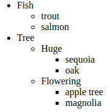
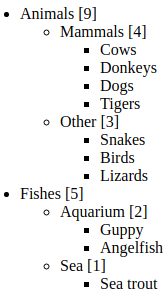

# createTextNode vs innerHTML vs textContent

Tenemos un elemento DOM vacío `elem` y una cadena` text`.

¿Cuál de estos 3 comandos hace exactamente lo mismo?

1. `elem.append(document.createTextNode(text))`
2. `elem.innerHTML = text`
3. `elem.textContent = text`

Resolvemos mediante este ejemplo:

```html
<div id="elem1"></div>
<div id="elem2"></div>
<div id="elem3"></div>
<script>
  let text = '<b>text</b>';

  elem1.append(document.createTextNode(text)); // <b>text</b>
  elem2.innerHTML = text; // text
  elem3.textContent = text; // <b>text</b>
</script>
```

# Clear the element

Cree una función `clear (elem)` que elimine todo del elemento.

```html
<ol id="elem">
  <li>Hello</li>
  <li>World</li>
</ol>

<script>
  function clear(elem) { /* your code */ }

  clear(elem); // clears the list
</script>
```

```html
<ol id="elem">
  <li>Hello</li>
  <li>World</li>
</ol>

<script>
  function clear(elem) {
    while (elem.firstChild) {
        elem.firstChild.remove();
    }
  }

  clear(elem); // clears the list
</script>
```

# Why does "aaa" remain?

En el ejemplo a continuación, la llamada `table.remove ()` elimina la tabla del documento.

Pero si lo ejecuta, puede ver que el texto `"aaa"` todavía está visible.

¿Por qué sucede eso?

```html
<table id="table">
  aaa
  <tr>
    <td>Test</td>
  </tr>
</table>

<script>
  alert(table); // the table, as it should be

  table.remove();
  // ¿Por qué todavía permanece aaa en el documento?
</script>
```

La pregunta se puede responder fácilmente explorando el DOM utilizando las herramientas del navegador. Muestra `"aaa"` antes de la `<table>`.

# Create a list

Escriba una interfaz para crear una lista a partir de la entrada del usuario.

Para cada elemento de la lista:

1. Pregúntele a un usuario sobre su contenido usando `prompt`
2. Cree el `<li>` con él y agréguelo a `<ul>`.
3. Continúe hasta que el usuario cancele la entrada (presionando la tecla `: Esc` o CANCELAR en el aviso).

Todos los elementos deben crearse dinámicamente.

Si un usuario escribe etiquetas HTML, debe ser tratado como un texto.

```html
<html>
<body>
  <h1>Create a list</h1>

  <script>
    let ul = document.createElement('ul');
    document.body.append(ul);

    while (true) {
      let data = prompt("Enter the text for the list item", "");

      if (!data) {
        break;
      }

      let li = document.createElement('li');
      li.textContent = data;
      ul.append(li);
    }
  </script>

</body>
</html>
```

# Create a tree from the object

Escriba una función `createTree` que cree una lista anidada` ul / li` a partir del objeto anidado.

Por ejemplo:

```js
let data = {
  "Fish": {
    "trout": {},
    "salmon": {}
  },

  "Tree": {
    "Huge": {
      "sequoia": {},
      "oak": {}
    },
    "Flowering": {
      "apple tree": {},
      "magnolia": {}
    }
  }
};
```

La sintaxis:

```js
let container = document.getElementById('container');
createTree(container, data); // creates the tree in the container
```

El resultado (árbol) debería verse así:



Elija una de las dos formas de resolver esta tarea:

1. Cree el HTML para el árbol y luego asigne a `container.innerHTML`.
2. Cree nodos de árbol y agregue con métodos DOM.

Sería genial si pudieras hacer ambas cosas.

PD El árbol no debe tener elementos "extra" como `<ul> </ul>` vacío para las hojas.

``` html
<html>
<body>

  <div id="container"></div>

  <script>
    let data = {
      "Fish": {
        "trout": {},
        "salmon": {}
      },

      "Tree": {
        "Huge": {
          "sequoia": {},
          "oak": {}
        },
        "Flowering": {
          "apple tree": {},
          "magnolia": {}
        }
      }
    };

    function createTree(container, obj) {
      container.innerHTML = createTreeText(obj);
    }

    function createTreeText(obj) { // standalone recursive function
      let li = '';
      let ul;
      for (let key in obj) {
        li += '<li>' + key + createTreeText(obj[key]) + '</li>';
      }
      if (li) {
        ul = '<ul>' + li + '</ul>'
      }
      return ul || '';
    }

    createTree(container, data);
  </script>
</body>
</html>
```

# Show descendants in a tree

Hay un árbol organizado como 'ul / li' anidado.

Escriba el código que agrega a cada `<li>` el número de sus descendientes. Saltar hojas (nodos sin hijos).

El resultado:



```html
<html>
<body>

  <ul>
    <li>Animals
      <ul>
        <li>Mammals
          <ul>
            <li>Cows</li>
            <li>Donkeys</li>
            <li>Dogs</li>
            <li>Tigers</li>
          </ul>
        </li>
        <li>Other
          <ul>
            <li>Snakes</li>
            <li>Birds</li>
            <li>Lizards</li>
          </ul>
        </li>
      </ul>
    </li>
    <li>Fishes
      <ul>
        <li>Aquarium
          <ul>
            <li>Guppy</li>
            <li>Angelfish</li>
          </ul>
        </li>
        <li>Sea
          <ul>
            <li>Sea trout</li>
          </ul>
        </li>
      </ul>
    </li>
  </ul>

  <script>
    let lis = document.getElementsByTagName('li');

    for (let li of lis) {
      // obtener el recuento de todos los <li> debajo de este <li>
      let descendantsCount = li.getElementsByTagName('li').length;
      if (!descendantsCount) continue;

      // agregar directamente al nodo de texto (agregar al texto)
      li.firstChild.data += ' [' + descendantsCount + ']';
    }
  </script>

</body>
```

# Create a calendar

Escriba una función `createCalendar (elem, año, mes)`.

La llamada debe crear un calendario para el año / mes dado y ponerlo dentro de 'elem'.

El calendario debe ser una tabla, donde una semana es `<tr>`, y un día es `<td>`. La parte superior de la tabla debe ser `<th>` con los nombres de los días laborables: el primer día debe ser lunes, y así hasta el domingo.

Por ejemplo, `createCalendar (cal, 2012, 9)` debería generar en el elemento `cal` el siguiente calendario:

```html
<html>

<head>
  <style>
    table {
      border-collapse: collapse;
    }

    td,
    th {
      border: 1px solid black;
      padding: 3px;
      text-align: center;
    }

    th {
      font-weight: bold;
      background-color: #E6E6E6;
    }
  </style>
</head>

<body>


  <div id="calendar"></div>

  <script>
    function createCalendar(elem, year, month) {

      let mon = month - 1; // months in JS are 0..11, not 1..12
      let d = new Date(year, mon);

      let table = '<table><tr><th>MO</th><th>TU</th><th>WE</th><th>TH</th><th>FR</th><th>SA</th><th>SU</th></tr><tr>';

      // spaces for the first row
      // from Monday till the first day of the month
      // * * * 1  2  3  4
      for (let i = 0; i < getDay(d); i++) {
        table += '<td></td>';
      }

      // <td> with actual dates
      while (d.getMonth() == mon) {
        table += '<td>' + d.getDate() + '</td>';

        if (getDay(d) % 7 == 6) { // sunday, last day of week - newline
          table += '</tr><tr>';
        }

        d.setDate(d.getDate() + 1);
      }

      // add spaces after last days of month for the last row
      // 29 30 31 * * * *
      if (getDay(d) != 0) {
        for (let i = getDay(d); i < 7; i++) {
          table += '<td></td>';
        }
      }

      // close the table
      table += '</tr></table>';

      elem.innerHTML = table;
    }

    function getDay(date) { // get day number from 0 (monday) to 6 (sunday)
      let day = date.getDay();
      if (day == 0) day = 7; // make Sunday (0) the last day
      return day - 1;
    }

    createCalendar(calendar, 2012, 9);
  </script>

</body>
</html>
```

El algoritmo:

1. Cree el encabezado de la tabla con `<th>` y nombres de días laborables.
2. Cree el objeto de fecha `d = new Date(year, month-1)`. Ese es el primer día de `month` (teniendo en cuenta que los meses en JavaScript comienzan desde` 0`, no `1`).
3. Las primeras celdas hasta el primer día del mes `d.getDay ()` pueden estar vacías. Vamos a completarlos con `<td> </td>`.
4. Aumente el día en `d`:` d.setDate (d.getDate () + 1) `. Si `d.getMonth ()` aún no es el próximo mes, entonces agregue la nueva celda `<td>` al calendario. Si es domingo, agregue una nueva línea <code> "& lt; / tr & gt; & lt; tr & gt;" </code>.
5. Si el mes ha finalizado, pero la fila de la tabla aún no está llena, agregue `<td>` vacía para que quede cuadrada.

# Colored clock with setInterval

Crea un reloj de color.

Use HTML / CSS para el estilo, JavaScript solo actualiza el tiempo en los elementos.

# Insert the HTML in the list

Escriba el código para insertar `<li> 2 </li> <li> 3 </li>` entre dos `<li>` aquí:

```html
<ul id="ul">
  <li id="one">1</li>
  <li id="two">4</li>
</ul>
```

# Sort the table

There's a table:

´´´html
<html>
<body>

  <table id="table">
    <tr>
      <th>Name</th>
      <th>Surname</th>
      <th>Age</th>
    </tr>
    <tr>
      <td>John</td>
      <td>Smith</td>
      <td>10</td>
    </tr>
    <tr>
      <td>Pete</td>
      <td>Brown</td>
      <td>15</td>
    </tr>
    <tr>
      <td>Ann</td>
      <td>Lee</td>
      <td>5</td>
    </tr>
  </table>

  <script>
    // ... your code ...
  </script>

</body>
</html>
```

Puede haber más filas en él.

Escriba el código para ordenarlo por la columna `"name"`.

La solución es breve:

```js
let sortedRows = Array.from(table.tBodies[0].rows) // (1)
  .sort((rowA, rowB) => rowA.cells[0].innerHTML > rowB.cells[0].innerHTML ? 1 : -1); // (2)

table.tBodies[0].append(...sortedRows); // (3)
```

1. Obtenga todos los `<tr>`, de `<tbody>`.
2. Luego ordénelos comparándolos por el contenido del primer `<td>` (el campo de nombre).
3. Ahora inserte los nodos en el orden correcto por `.append (... sortedRows)`.

    Las tablas siempre tienen un elemento `<tbody>` implícito, por lo que debemos tomarlo e insertarlo: un simple `table.append (...)` fallará.

    Tenga en cuenta: no tenemos que eliminarlos, simplemente "volver a insertarlos", abandonan el lugar antiguo automáticamente.