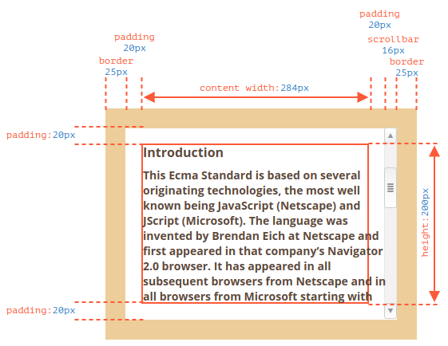
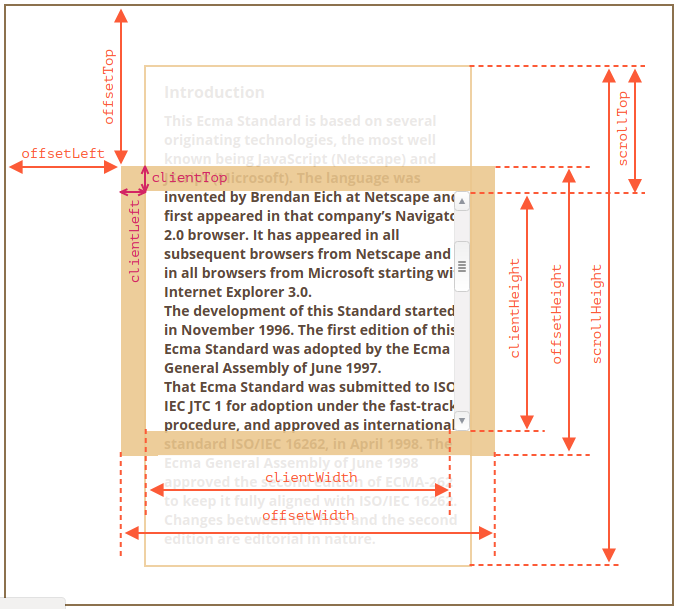
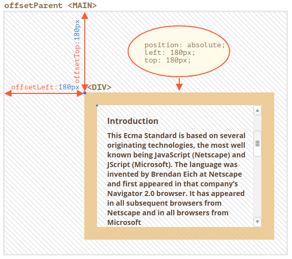
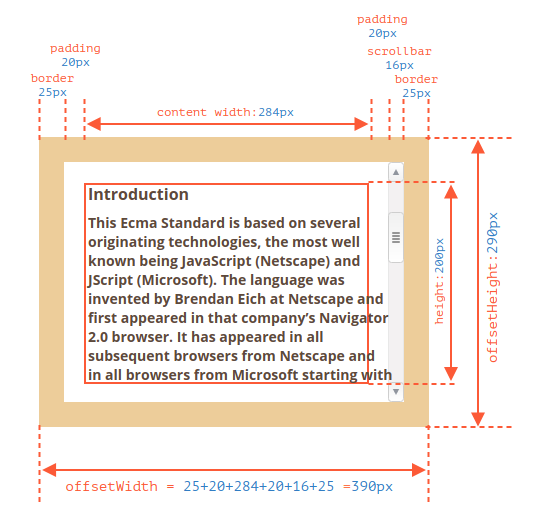
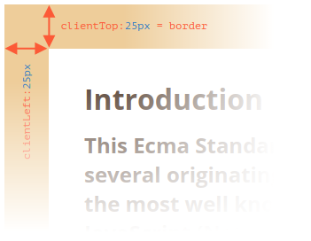
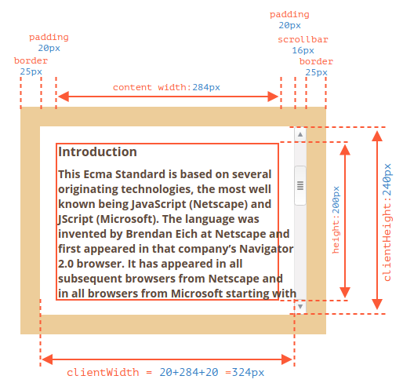
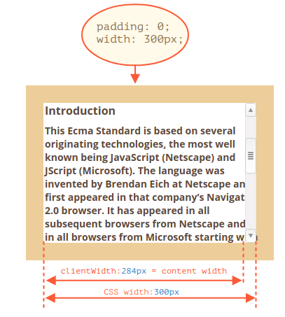
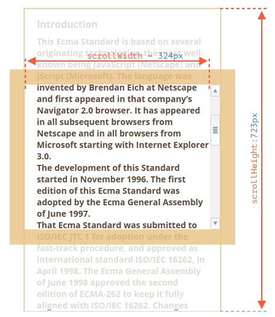
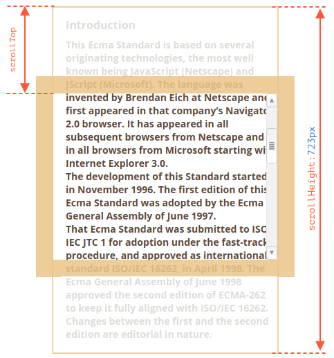

# Element size and scrolling

Hay muchas propiedades de JavaScript que nos permiten leer información sobre el ancho del elemento, la altura y otras funciones de geometría.

A menudo lo necesitamos al mover o posicionar elementos en JavaScript.

## Sample element

Como elemento de muestra para demostrar las propiedades, usaremos el siguiente ejemplo:

```html
<div id="example">
  ...Text...
</div>
<style>
  #example {
    width: 300px;
    height: 200px;
    border: 25px solid #E8C48F;
    padding: 20px;              
    overflow: auto;             
  }
</style>
```

Tiene el borde, el relleno y el desplazamiento. El conjunto completo de características. No hay márgenes, ya que no son parte del elemento en sí, y no hay propiedades especiales para ellos.

El elemento se ve así:



## Geometry

Aquí está la imagen general con propiedades de geometría:



Los valores de estas propiedades son técnicamente números, pero estos números son "de píxeles", por lo que estas son mediciones de píxeles.

Comencemos a explorar las propiedades comenzando desde el exterior del elemento.

## offsetParent, offsetLeft/Top

Estas propiedades rara vez son necesarias, pero aún así son las propiedades de geometría "más externas", por lo que comenzaremos con ellas.

El `offsetParent` es el ancestro más cercano que utiliza el navegador para calcular las coordenadas durante el renderizado.

Ese es el antepasado más cercano que es uno de los siguientes:

1. CSS-posicionado ( positiones absolute, relative, fixedo sticky), o
2. <td>, <th>, O <table>, o
3. <body>.

Las propiedades `offsetLeft / offsetTop` proporcionan coordenadas x / y relativas a la esquina superior izquierda` offsetParent`.

En el siguiente ejemplo, el `<div>` interno tiene `<main>` como `offsetParent` y` offsetLeft / offsetTop` se desplaza desde su esquina superior izquierda (`180`):

```html
<main style="position: relative" id="main">
  <article>
    <div id="example" style="position: absolute; left: 180px; top: 180px">...</div>
  </article>
</main>
<script>
  alert(example.offsetParent.id); // main
  alert(example.offsetLeft); // 180 (note: a number, not a string "180px")
  alert(example.offsetTop); // 180
</script>
```



Hay varias ocasiones en que `offsetParent` es` null`:

1. Para elementos no mostrados (`display: none`).
2. Para `<body>` y `<html>`.
3. Para elementos con `position: fixed`.

## offsetWidth/Height

Ahora pasemos al elemento en sí.

Estas dos propiedades son las más simples. Proporcionan el ancho / alto "externo" del elemento. O, en otras palabras, su tamaño completo, incluidos los bordes.



Para nuestro elemento de muestra:

- `offsetWidth = 390` - el ancho exterior, se puede calcular como ancho CSS interno (` 300px`) más relleno (`2 * 20px`) y bordes (` 2 * 25px`).
- `offsetHeight = 290` - la altura exterior.

## clientTop/Left

Dentro del elemento tenemos los bordes.

Para medirlos, hay propiedades `clientTop` y` clientLeft`.

En nuestro ejemplo:

- `clientLeft = 25` - ancho del borde izquierdo
- `clientTop = 25` - ancho del borde superior



Pero para ser precisos, estas propiedades no son el ancho / alto del borde, sino coordenadas relativas del lado interno desde el lado externo.

En ese caso, `clientLeft` no sería` 25`, sino con el ancho de la barra de desplazamiento `25 + 16 = 41`.

Aquí está el ejemplo en hebreo:


## clientWidth/Height

Estas propiedades proporcionan el tamaño del área dentro de los bordes del elemento.

Incluyen el ancho del contenido junto con los rellenos, pero sin la barra de desplazamiento:



En la imagen de arriba consideremos primero `clientHeight`.

No hay una barra de desplazamiento horizontal, por lo que es exactamente la suma de lo que hay dentro de los bordes: CSS-height `200px` más relleno superior e inferior (` 2 * 20px`) total `240px`.

Ahora `clientWidth` - aquí el ancho del contenido no es` 300px`, sino `284px`, porque` 16px` están ocupados por la barra de desplazamiento. Entonces, la suma es `284px` más los rellenos izquierdo y derecho, total` 324px`.

**Si no hay rellenos, `clientWidth / Height` es exactamente el área de contenido, dentro de los bordes y la barra de desplazamiento (si corresponde).**



Entonces, cuando no hay relleno, podemos usar `clientWidth / clientHeight` para obtener el tamaño del área de contenido.

## scrollWidth/Height

Estas propiedades son como `clientWidth / clientHeight`, pero también incluyen las partes desplazadas (ocultas):



En la imagen de arriba:

- `scrollHeight = 723` - es la altura interna total del área de contenido, incluidas las partes desplazadas.
- `scrollWidth = 324` - es el ancho interno completo, aquí no tenemos desplazamiento horizontal, por lo que es igual a` clientWidth`.

Podemos usar estas propiedades para expandir el elemento de ancho a su ancho / alto completo.

Como esto:

```js
// expandir el elemento a la altura del contenido completo
element.style.height = `${element.scrollHeight}px`;
```

## scrollLeft/scrollTop

Las propiedades `scrollLeft / scrollTop` son el ancho / alto de la parte oculta y desplazada del elemento.

En la imagen de abajo podemos ver `scrollHeight` y` scrollTop` para un bloque con un desplazamiento vertical.



En otras palabras, `scrollTop` es" cuánto se desplaza hacia arriba ".

La mayoría de las propiedades de geometría son de solo lectura, pero `scrollLeft / scrollTop` se pueden cambiar y el navegador desplazará el elemento.

## Don't take width/height from CSS

Acabamos de cubrir las propiedades de geometría de los elementos DOM, que se pueden usar para obtener anchos, alturas y calcular distancias.

Pero como sabemos por el capítulo <info: styles-and-classes>, podemos leer CSS-height y width usando `getComputedStyle`.

```js
let elem = document.body;

alert( getComputedStyle(elem).width ); // show CSS width for elem
```

Hay dos razones Por las que deberíamos usar propiedades de geometría en su lugar

1. Primero, el 'ancho / alto' de CSS depende de otra propiedad: 'box-sizing' que define "qué es" ancho y alto de CSS. Un cambio en 'box-sizing' para fines de CSS puede romper dicho JavaScript.
2. Segundo, 'ancho / alto' CSS puede ser 'auto', por ejemplo para un elemento en línea:

    ```html
    <span id="elem">Hello!</span>

    <script>
      alert( getComputedStyle(elem).width ); // auto
    </script>
    ```

Desde el punto de vista de CSS, `width: auto` es perfectamente normal, pero en JavaScript necesitamos un tamaño exacto en` px` que podamos usar en los cálculos. Entonces aquí el ancho de CSS es inútil.

Pero con `getComputedStyle (elem) .width` la situación es diferente. Algunos navegadores (por ejemplo, Chrome) devuelven el ancho interno real, menos la barra de desplazamiento, y algunos de ellos (por ejemplo, Firefox): ancho de CSS (ignora la barra de desplazamiento). Tales diferencias entre navegadores son la razón para no usar `getComputedStyle`.

La diferencia descrita se trata solo de leer `getComputedStyle (...). Width` de JavaScript, visualmente todo es correcto.

