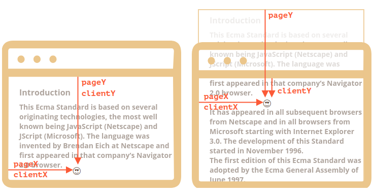
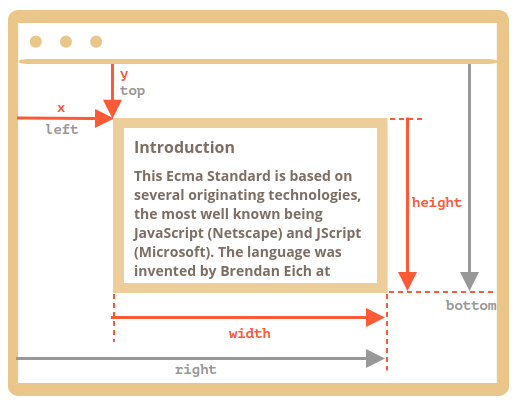

# Coordinates

Para mover elementos, debemos estar familiarizados con las coordenadas.

La mayoría de los métodos de JavaScript tratan con uno de los dos sistemas de coordenadas:

1. **Relativo a la ventana**: similar a `position:fixed`, calculado desde el borde superior / izquierdo de la ventana.
    
   - Denotaremos estas coordenadas como `clientX / clientY`.

2. **Relativo al documento**: similar a `position:absolute` en la raíz del documento, calculado a partir del borde superior / izquierdo del documento.
    
   - los denotaremos `pageX / pageY`.

Cuando la página se desplaza hasta el principio, de modo que la esquina superior / izquierda de la ventana es exactamente la esquina superior / izquierda del documento, estas coordenadas son iguales entre sí. Pero después de que el documento cambia, las coordenadas relativas a la ventana de los elementos cambian, a medida que los elementos se mueven a través de la ventana, mientras que las coordenadas relativas al documento permanecen iguales.

En esta imagen tomamos un punto en el documento y demostramos sus coordenadas antes del desplazamiento (izquierda) y después (derecha):



Cuando el documento se desplazó:
- `pageY` - la coordenada relativa al documento se mantuvo igual, se cuenta desde la parte superior del documento (ahora desplazada).
- `clientY` - la coordenada relativa a la ventana cambió (la flecha se acortó), ya que el mismo punto se acercó a la parte superior de la ventana.

## Element coordinates: getBoundingClientRect

El método `elem.getBoundingClientRect ()` devuelve las coordenadas de la ventana para un rectángulo mínimo que encierra `elem` como un objeto de la clase DOMRect incorporada.

Principales propiedades `DOMRect`:

- `x / y` - Coordenadas X / Y del origen del rectángulo relativo a la ventana,
- `ancho / alto` - ancho / alto del rectángulo (puede ser negativo).

Además, hay propiedades derivadas:

- `top / bottom` - Coordenada Y para el borde del rectángulo superior / inferior,
- `left / right` - Coordenada X para el borde del rectángulo izquierdo / derecho.

Aquí está la imagen de la salida `elem.getBoundingClientRect ()`:



Como puede ver, 'x / y' y 'ancho / alto' describen completamente el rectángulo. Las propiedades derivadas se pueden calcular fácilmente a partir de ellas:

- `left = x`
- `top = y`
- `right = x + width`
- `bottom = y + height`

Tenga en cuenta:

- Las coordenadas pueden ser fracciones decimales, como `10.5`. Eso es normal, internamente el navegador usa fracciones en los cálculos. No tenemos que redondearlos cuando establecemos en `style.left / top`.
- Las coordenadas pueden ser negativas. Por ejemplo, si la página se desplaza de modo que `elem` esté ahora sobre la ventana, entonces` elem.getBoundingClientRect (). Top` es negativo.

## elementFromPoint(x, y)

La llamada a `document.elementFromPoint (x, y)` devuelve el elemento más anidado en las coordenadas de la ventana `(x, y)`.

La sintaxis es:

```js
let elem = document.elementFromPoint(x, y);
```

Por ejemplo, el siguiente código resalta y genera la etiqueta del elemento que ahora está en el medio de la ventana:

```js
let centerX = document.documentElement.clientWidth / 2;
let centerY = document.documentElement.clientHeight / 2;

let elem = document.elementFromPoint(centerX, centerY);

elem.style.background = "red";
alert(elem.tagName);
```

Como usa coordenadas de ventana, el elemento puede ser diferente dependiendo de la posición de desplazamiento actual.

## Using for "fixed" positioning

La mayoría de las veces necesitamos coordenadas para posicionar algo.

Para mostrar algo cerca de un elemento, podemos usar `getBoundingClientRect` para obtener sus coordenadas, y luego CSS` position` junto con `left / top` (o` right / bottom`).

Por ejemplo, la siguiente función `createMessageUnder (elem, html)` muestra el mensaje debajo de `elem`:

```js
let elem = document.getElementById("coords-show-mark");

function createMessageUnder(elem, html) {
  // create message element
  let message = document.createElement('div');
  // better to use a css class for the style here
  message.style.cssText = "position:fixed; color: red";

  // assign coordinates, don't forget "px"!
  let coords = elem.getBoundingClientRect();

  message.style.left = coords.left + "px";
  message.style.top = coords.bottom + "px";

  message.innerHTML = html;

  return message;
}

// Usage:
// add it for 5 seconds in the document
let message = createMessageUnder(elem, 'Hello, world!');
document.body.append(message);
setTimeout(() => message.remove(), 5000);
```

El código se puede modificar para mostrar el mensaje a la izquierda, derecha, abajo, aplicar animaciones CSS para "fundirlo" y así sucesivamente. Eso es fácil, ya que tenemos todas las coordenadas y tamaños del elemento.

Hay que tener en cuenta un detalle: cuando se desplaza la página, el mensaje sale del botón.

Esto es porque el elemento del mensaje se basa en `posición: fijo`, por lo que permanece en el mismo lugar de la ventana mientras la página se desplaza.

Para cambiar eso, necesitamos usar coordenadas basadas en documentos y `position: absolute`.

## Document coordinates [#getCoords]

Las coordenadas relativas al documento comienzan desde la esquina superior izquierda del documento, no desde la ventana.

En CSS, las coordenadas de la ventana corresponden a `position: fixed`, mientras que las coordenadas del documento son similares a` position: absolute` en la parte superior.

Podemos usar `position: absolute` y` top / left` para colocar algo en un lugar determinado del documento, de modo que permanezca allí durante el desplazamiento de una página. Pero primero necesitamos las coordenadas correctas.

No hay un método estándar para obtener las coordenadas del documento de un elemento. Pero es fácil escribirlo.

Los dos sistemas de coordenadas están conectados por la fórmula:
- `pageY` =` clientY` + altura de la parte vertical desplazada del documento.
- `pageX` =` clientX` + ancho de la parte horizontal desplazada del documento.

La función `getCoords (elem)` tomará las coordenadas de la ventana de `elem.getBoundingClientRect ()` y les agregará el desplazamiento actual:

```js
// get document coordinates of the element
function getCoords(elem) {
  let box = elem.getBoundingClientRect();

  return {
    top: box.top + pageYOffset,
    left: box.left + pageXOffset
  };
}
```

Si en el ejemplo anterior lo usamos con `position: absolute`, entonces el mensaje permanecería cerca del elemento en el desplazamiento.

La función modificada `createMessageUnder`:

```js
function createMessageUnder(elem, html) {
  let message = document.createElement('div');
  message.style.cssText = "position:absolute; color: red";

  let coords = getCoords(elem);

  message.style.left = coords.left + "px";
  message.style.top = coords.bottom + "px";

  message.innerHTML = html;

  return message;
}
```